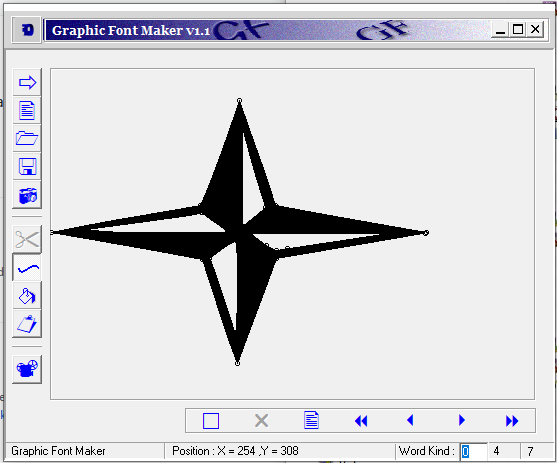

# Graphic Font Maker
A custom Font and Vector generating project Developed in Delphi

# Version
This projects is the first version and developed in 2000. At that time Unicode was not popular an it doesn't support Farsi and Arabic characters. So I was using this application to generate my own fonts for my applications.

# Usage
With this project you can generate custom vector images that can save separately as GF files and can re-open it in your other projects. This GF files can store many layers and vectors in them like Fonts and characters.

